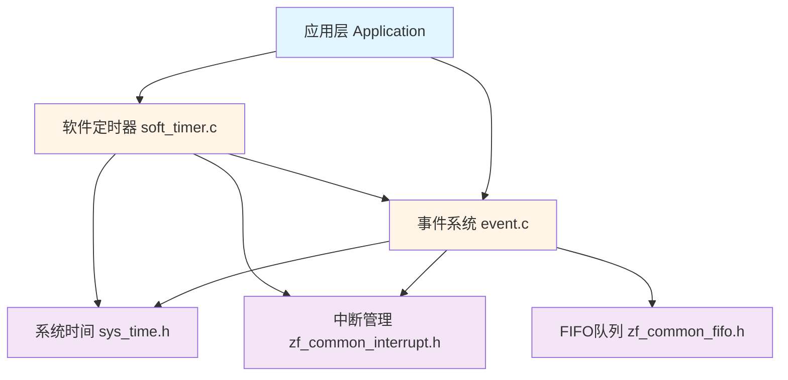
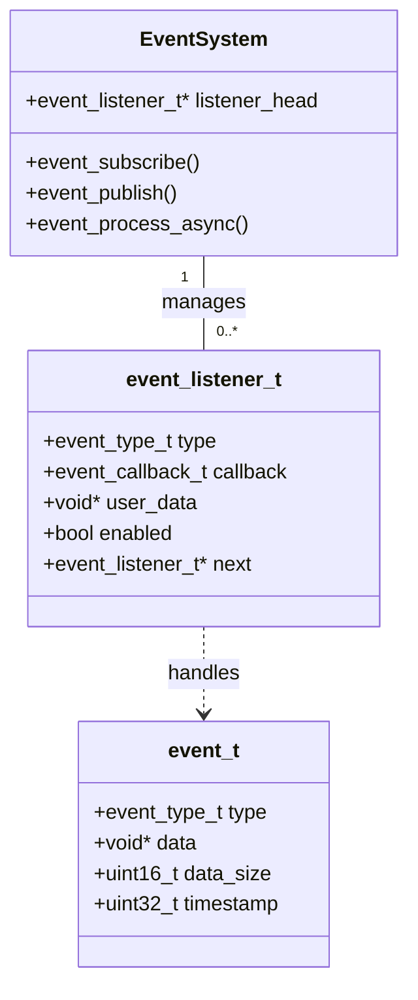
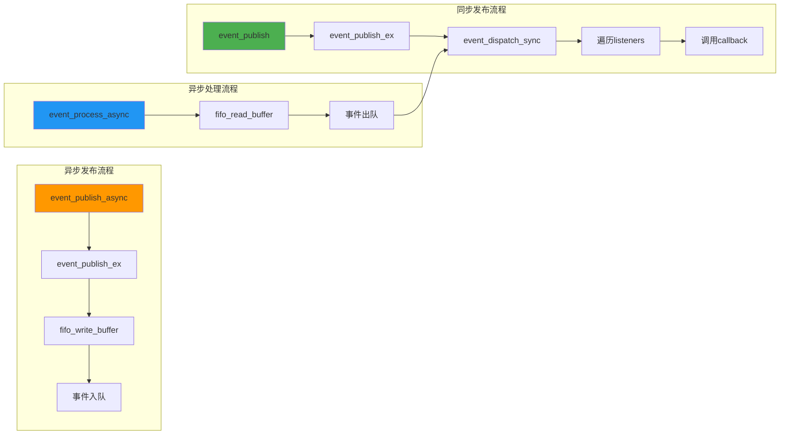
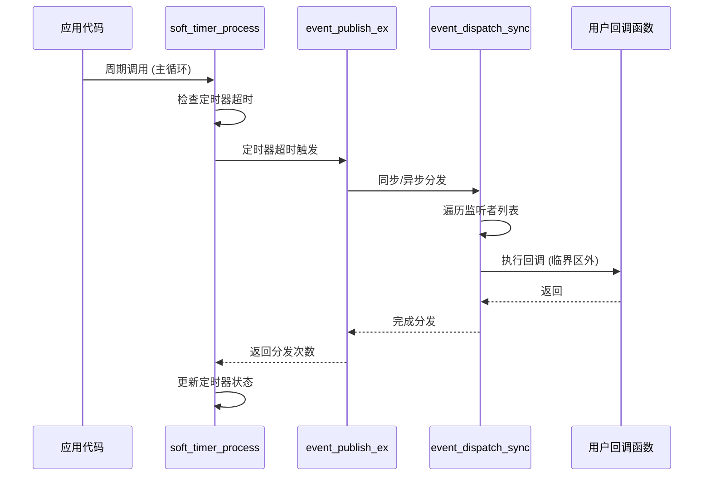
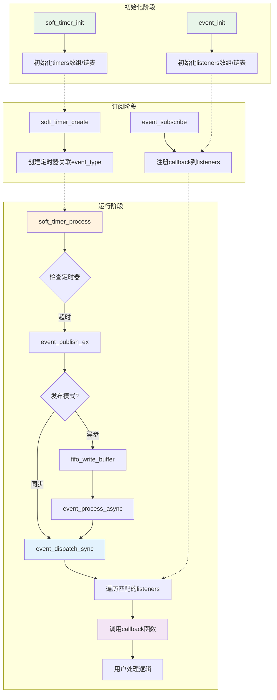
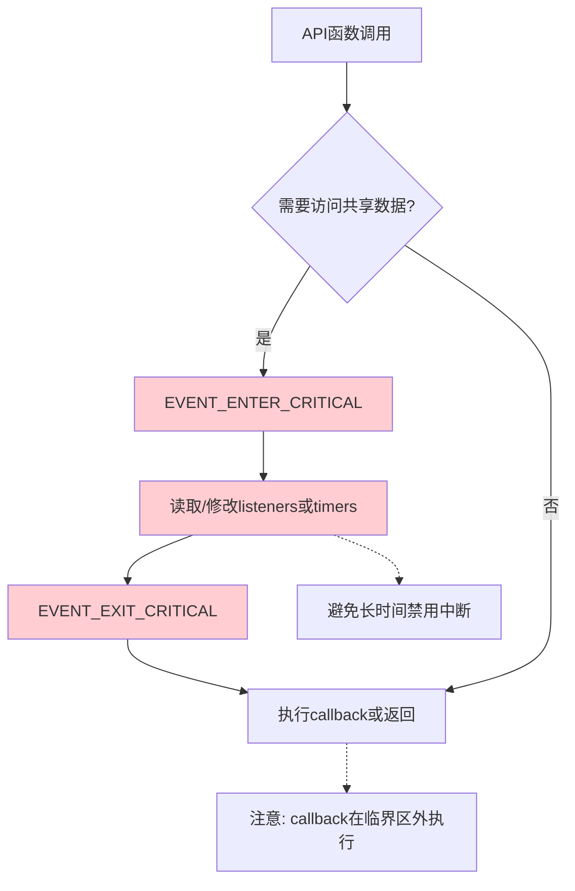

# 事件系统和软件定时器

轻量级事件系统和软件定时器模块，用于实现事件驱动编程和时间管理。**软件定时器完全基于事件系统**，实现最佳的模块解耦和代码复用。

## 目录结构

```
event/
├── event.h          - 事件系统头文件
├── event.c          - 事件系统实现
├── soft_timer.h     - 软件定时器头文件
├── soft_timer.c     - 软件定时器实现
└── README.md        - 说明文档
```

## 功能特性

### 事件系统 (Event System)

- ✅ **发布/订阅模式**：解耦事件发布者和订阅者
- ✅ **灵活内存管理**：支持静态/动态内存分配（宏配置）
- ✅ **中断安全**：可选的临界区保护，支持在中断中使用
- ✅ **可选异步发布**：支持同步/异步两种发布模式（异步基于 FIFO 出队处理）
- ✅ **多订阅者支持**：一个事件可以有多个监听者
- ✅ **事件数据传递**：支持传递自定义数据
- ✅ **时间戳记录**：自动记录事件发生时间
- ✅ **统计功能**：跟踪事件发布和分发次数

### 软件定时器 (Software Timer)

- ✅ **基于事件系统**：定时器超时时自动发布事件，无需回调函数
- ✅ **单次和周期模式**：支持一次性定时和周期性定时
- ✅ **灵活内存管理**：支持静态/动态内存分配（宏配置）
- ✅ **中断安全**：可选的临界区保护
- ✅ **暂停/恢复功能**：可以暂停和恢复定时器
- ✅ **剩余时间查询**：可查询定时器剩余时间
- ✅ **抗漂移设计**：周期模式基于理论触发时间更新，消除回调耗时累积误差
- ✅ **轻量级实现**：基于系统毫秒计时器，不占用硬件定时器资源

## 设计理念

**软件定时器基于事件系统**，定时器超时时会发布事件。支持两种使用方式：

### 方式1：事件订阅模式（推荐）
通过 `event_subscribe` 订阅事件类型，定时器创建时 callback 参数传 NULL：
- **模块解耦**：定时器逻辑和业务逻辑完全分离
- **一对多响应**：一个定时器事件可以触发多个处理函数
- **统一机制**：所有异步事件使用相同的处理方式
- **易于调试**：事件流清晰可追踪

### 方式2：直接回调模式
在 `soft_timer_create` 时直接传入 callback 函数：
- **快捷简单**：无需单独调用 `event_subscribe`
- **一对一**：一个定时器对应一个回调函数
- **适合简单场景**：快速实现单一定时任务

**注意**：如果同时使用两种方式（既订阅事件又传入 callback），定时器超时时会同时触发订阅者和 callback。

## 架构与调用关系

### 模块依赖关系图



### 类结构图



### 事件系统内部调用流程



### 软件定时器与事件系统集成



### 完整数据流图



### 关键函数调用统计

| 模块 | 对外接口函数 | 内部函数 | 跨模块调用 |
|------|------------|---------|-----------|
| **event.c** | 13个 | 1个 (event_dispatch_sync) | sys_time_get_ms, interrupt_global_*, fifo_* |
| **soft_timer.c** | 14个 | 1个 (find_timer_by_id) | event_publish_ex, sys_time_get_ms, interrupt_global_* |

### 临界区保护范围



## 配置选项

所有配置选项都可以通过宏定义在编译前配置，实现零运行时开销的条件编译。

### 事件系统配置 (event.h)

```c
// 动态内存分配 (默认: 0 = 静态)
#de性能统计与调试

模块内置了基于 DWT 周期计数器的高精度性能统计功能，用于分析回调函数的执行耗时。

### 开启统计
在 `soft_timer.h` 或编译器宏中设置：
```c
#define TIMER_ENABLE_PERF_STATS 1
```

### 查看报告
系统会自动记录每个定时器的最大、最小、平均执行时间和调用次数，并每隔 10秒（默认）通过日志打印：
```text
[Timer_Perf] process: avg=12us, max=45us, calls=5000
[Timer_Perf] scan: avg=5us, max=18us, calls=5000
```

### 调试建议
- **监控 max_cycles**：如果某个定时器的最大执行时间过长，可能会阻塞其他任务，应考虑将其移至异步模式或拆分任务。
- **Release 版本**：建议在 Release 版本中关闭此功能 (`TIMER_ENABLE_PERF_STATS 0`) 以节省内存和 CPU 资源。

## fine EVENT_USE_DYNAMIC_MEMORY    0   // 0=静态, 1=动态

// 中断安全保护 (默认: 1 = 启用)
#define EVENT_INTERRUPT_SAFE        1   // 0=禁用, 1=启用

// 最大监听者数量 (仅静态内存模式, 默认: 32)
#define EVENT_MAX_LISTENERS         32

// 启用异步发布支持 (默认: 1 = 启用)
#define EVENT_ENABLE_ASYNC          1   // 0=禁用异步队列, 1=启用

// 异步事件队列容量（事件个数，启用异步时有效）
#define EVENT_ASYNC_QUEUE_SIZE      32
```

### 软件定时器配置 (soft_timer.h)

```c
// 动态内存分配 (默认: 0 = 静态)
#define TIMER_USE_DYNAMIC_MEMORY    0   // 0=静态, 1=动态

// 中断安全保护 (默认: 1 = 启用)
#define TIMER_INTERRUPT_SAFE        1   // 0=禁用, 1=启用

// 最大定时器数量 (仅静态内存模式, 默认: 16)
#define SOFT_TIMER_MAX_COUNT        16

// 定时器触发时事件发布模式（默认同步，可设为 EVENT_DISPATCH_ASYNC）
#define TIMER_DEFAULT_DISPATCH_MODE EVENT_DISPATCH_SYNC
```

## 内存占用

### 事件系统
- **静态模式**：约 512 字节（32个监听者 × 16字节，固定大小数组）
- **动态模式**：使用链表按需分配，无数量限制，仅受堆内存大小限制

### 软件定时器
- **静态模式**：约 384 字节（16个定时器 × 24字节，固定大小数组）
- **动态模式**：使用链表按需分配，无数量限制，仅受堆内存大小限制

## 使用说明

### 1. 中断安全性

**为什么需要中断安全？**

在没有临界区保护的情况下，如果中断服务程序和主循环同时访问事件监听者数组或定时器数组，会发生**数据竞争**：

```c
// 主循环中
event_subscribe(EVENT_TYPE, callback, NULL);  // 正在修改 listeners[5]

// 此时中断发生
void ISR_Handler(void) {
    event_publish(EVENT_TYPE, data, size);     // 同时访问 listeners[5]
    // 可能读取到不一致的数据！
}
```

**如何实现中断安全？**

使用临界区保护（禁用中断）：

```c
// event.c 中的实现
#if EVENT_INTERRUPT_SAFE
    #define EVENT_ENTER_CRITICAL()  uint32 primask = interrupt_global_disable()
    #define EVENT_EXIT_CRITICAL()   interrupt_global_enable(primask)
#endif

int event_subscribe(...) {
    EVENT_ENTER_CRITICAL();  // 禁用中断
    // ... 修改共享数据 ...
    EVENT_EXIT_CRITICAL();   // 恢复中断
}
```

**注意事项**：
- 临界区应尽可能短，避免长时间禁用中断
- 回调函数在临界区外执行，避免阻塞
- 如果只在主循环使用，可关闭中断保护以提高性能

### 2. 动态内存分配

**静态内存模式**（默认）：
```c
// 编译时分配固定大小数组
event_init();           // 使用 EVENT_MAX_LISTENERS (默认32)
soft_timer_init();      // 使用 SOFT_TIMER_MAX_COUNT (默认16)
```

**动态内存模式**：
```c
// 使用链表，无数量限制，按需分配
event_init();           // 初始化链表头指针
soft_timer_init();      // 初始化链表头指针

// 使用完毕后释放所有节点
event_deinit();
soft_timer_deinit();
```

**优缺点对比**：

| 特性 | 静态模式 | 动态模式 |
|------|---------|---------|
| 数据结构 | 固定大小数组 | 单链表 |
| 内存分配 | 编译时 | 运行时（按需） |
| 数量限制 | 固定上限 | 无限制（仅受堆内存限制） |
| 内存利用率 | 可能浪费 | 按需分配，利用率高 |
| 访问速度 | O(1) 直接索引 | O(n) 链表遍历 |
| 内存碎片 | 无 | 可能产生 |
| 适用场景 | 实时系统、数量固定 | 数量不确定、内存受限 |

## 使用示例

### 示例 1：基础事件系统（静态内存 + 中断安全）

```c
#include "event.h"

// 定义事件类型
#define EVENT_BUTTON_PRESS      1
#define EVENT_SENSOR_UPDATE     2

// 事件回调函数
void on_button_press(const event_t *event, void *user_data)
{
    printf("Button pressed at %u ms\n", event->timestamp);
}

void on_sensor_update(const event_t *event, void *user_data)
{
    float *value = (float*)event->data;
    printf("Sensor: %.2f\n", *value);
}

int main(void)
{
    // 初始化（静态内存）
    event_init();

    // 订阅事件
    event_subscribe(EVENT_BUTTON_PRESS, on_button_press, NULL);
    event_subscribe(EVENT_SENSOR_UPDATE, on_sensor_update, NULL);

    // 在主循环或中断中发布事件（线程安全）
    float sensor_value = 25.5f;
    event_publish(EVENT_SENSOR_UPDATE, &sensor_value, sizeof(float));

    return 0;
}
```

### 示例 2：软件定时器（事件驱动）

```c
#include "event.h"
#include "soft_timer.h"

// 定义定时器事件
#define EVENT_SENSOR_READ       (TIMER_EVENT_BASE + 1)
#define EVENT_HEARTBEAT         (TIMER_EVENT_BASE + 2)

// 事件处理函数
void on_sensor_read(const event_t *event, void *user_data)
{
    printf("Reading sensor...\n");
    // 读取传感器并处理数据
}

void on_heartbeat(const event_t *event, void *user_data)
{
    printf("Heartbeat\n");
}

int main(void)
{
    // 初始化系统
    event_init();
    soft_timer_init();

    // 订阅定时器事件
    event_subscribe(EVENT_SENSOR_READ, on_sensor_read, NULL);
    event_subscribe(EVENT_HEARTBEAT, on_heartbeat, NULL);

    // 创建定时器（周期读取传感器 100ms）
    soft_timer_id_t sensor_timer = soft_timer_create(100, TIMER_MODE_PERIODIC,
                                             EVENT_SENSOR_READ, NULL, 0,
                                             on_sensor_read, EVENT_DISPATCH_SYNC);

    // 创建心跳定时器（1000ms）
    soft_timer_id_t heartbeat_timer = soft_timer_create(1000, TIMER_MODE_PERIODIC,
                                                EVENT_HEARTBEAT, NULL, 0,
                                                on_heartbeat, EVENT_DISPATCH_SYNC);

    // 启动定时器
    soft_timer_start(sensor_timer);
    soft_timer_start(heartbeat_timer);

    // 主循环
    while (1) {
        soft_timer_process();  // 必须周期调用！
        delay_ms(10);
    }

    return 0;
}
```

### 示例 2B：软件定时器（直接回调模式）

```c
#include "soft_timer.h"

// 直接回调函数
void sensor_callback(const event_t *event, void *user_data)
{
    printf("Reading sensor (callback)...\n");
}

void heartbeat_callback(const event_t *event, void *user_data)
{
    printf("Heartbeat (callback)\n");
}

int main(void)
{
    // 初始化系统
    soft_timer_init();

    // 创建定时器（直接传入回调，无需订阅事件）
    soft_timer_id_t sensor_timer = soft_timer_create(100, TIMER_MODE_PERIODIC,
                                             0, NULL, 0,  // event_type 可传 0
                                             sensor_callback, EVENT_DISPATCH_SYNC);

    soft_timer_id_t heartbeat_timer = soft_timer_create(1000, TIMER_MODE_PERIODIC,
                                                0, NULL, 0,
                                                heartbeat_callback, EVENT_DISPATCH_SYNC);

    // 启动定时器
    soft_timer_start(sensor_timer);
    soft_timer_start(heartbeat_timer);

    // 主循环
    while (1) {
        soft_timer_process();
        delay_ms(10);
    }

    return 0;
}
```

### 示例 3：一个定时器事件多个处理者

```c
#include "event.h"
#include "soft_timer.h"

#define EVENT_SYSTEM_TICK   (TIMER_EVENT_BASE + 10)

// 多个模块订阅同一个定时器事件
void module_a_tick(const event_t *event, void *user_data)
{
    printf("Module A tick\n");
}

void module_b_tick(const event_t *event, void *user_data)
{
    printf("Module B tick\n");
}

void module_c_tick(const event_t *event, void *user_data)
{
    printf("Module C tick\n");
}

int main(void)
{
    event_init();
    soft_timer_init();

    // 三个模块都订阅同一个定时器事件
    event_subscribe(EVENT_SYSTEM_TICK, module_a_tick, NULL);
    event_subscribe(EVENT_SYSTEM_TICK, module_b_tick, NULL);
    event_subscribe(EVENT_SYSTEM_TICK, module_c_tick, NULL);

    // 创建一个定时器，超时时会触发所有三个模块
    soft_timer_id_t tick_timer = soft_timer_create(50, TIMER_MODE_PERIODIC,
                                           EVENT_SYSTEM_TICK, NULL, 0,
                                           NULL, EVENT_DISPATCH_SYNC);
    soft_timer_start(tick_timer);

    while (1) {
        soft_timer_process();
        delay_ms(10);
    }

    return 0;
}
```

### 示例 4：动态内存分配（链表模式）

```c
#define EVENT_USE_DYNAMIC_MEMORY    1  // 在包含头文件前定义
#define TIMER_USE_DYNAMIC_MEMORY    1

#include "event.h"
#include "soft_timer.h"

int main(void)
{
    // 动态初始化（使用链表，无数量限制）
    event_init();           // 初始化链表头指针
    soft_timer_init();      // 初始化链表头指针

    // 可以创建任意数量的监听者和定时器（仅受堆内存限制）
    for (int i = 0; i < 100; i++) {
        event_subscribe(EVENT_TYPE, callback, NULL);  // 动态分配新节点
    }

    for (int i = 0; i < 50; i++) {
        soft_timer_create(1000, TIMER_MODE_PERIODIC,
                         TIMER_EVENT_BASE + i, NULL, 0,
                         NULL, EVENT_DISPATCH_SYNC);  // 动态分配新节点
    }

    // 正常使用...

    // 程序结束前释放所有链表节点
    event_deinit();         // 释放所有监听者节点
    soft_timer_deinit();    // 释放所有定时器节点

    return 0;
}
```

### 示例 5：在中断中使用（中断安全）

```c
#include "event.h"

#define EVENT_UART_RX           10

// 在中断服务程序中发布事件（线程安全）
void UART_IRQHandler(void)
{
    if (uart_rx_complete) {
        uint8_t data = uart_read_byte();
        event_publish(EVENT_UART_RX, &data, sizeof(data));  // 安全！
    }
}

// 在主循环中处理
void on_uart_rx(const event_t *event, void *user_data)
{
    uint8_t data = *(uint8_t*)event->data;
    printf("Received: 0x%02X\n", data);
}

int main(void)
{
    event_init();
    event_subscribe(EVENT_UART_RX, on_uart_rx, NULL);

    // 启用UART中断...

    while (1) {
        // 主循环任务...
    }

    return 0;
}
```

### 示例 6：异步事件发布与处理

```c
#include "event.h"

void on_evt(const event_t *e, void *ud) {
    // 处理耗时逻辑
}

int main(void) {
    event_init();
    event_subscribe(1, on_evt, NULL);

    // 异步发布（入队），主循环里定期出队
    event_publish_async(1, NULL, 0);

    while (1) {
        event_process_async();  // 处理异步队列
        // 其他任务...
    }
}
```

### 示例 7：定时器异步触发

```c
#include "event.h"
#include "soft_timer.h"

void on_tick(const event_t *e, void *ud) { /* ...耗时处理... */ }

int main(void) {
    event_init();
    soft_timer_init();

    event_subscribe(100, on_tick, NULL);
    soft_timer_id_t t = soft_timer_create(50, TIMER_MODE_PERIODIC, 100, NULL, 0,
                                          on_tick, EVENT_DISPATCH_ASYNC);
    // 定时器创建时已指定异步发布模式
    soft_timer_start(t);

    while (1) {
        soft_timer_process();
        event_process_async();  // 必须调用，处理异步触发的事件
    }
}
```

## API 参考

### 事件系统 API

| 函数 | 说明 |
|------|------|
| `event_init()` | 初始化事件系统（静态：数组，动态：链表） |
| `event_deinit()` | 释放资源（动态模式：释放所有链表节点） |
| `event_subscribe()` | 订阅事件 |
| `event_unsubscribe()` | 取消订阅 |
| `event_publish()` | 发布事件（同步，带数据） |
| `event_publish_ex()` | 发布事件（可选同步/异步） |
| `event_publish_async()` | 发布事件（异步入队） |
| `event_publish_simple()` | 发布事件（无数据） |
| `event_set_listener_enabled()` | 启用/禁用监听者 |
| `event_unsubscribe_all()` | 取消所有指定类型的订阅 |
| `event_clear_all()` | 清空所有订阅 |
| `event_process_async()` | 处理异步事件队列（启用异步时必须周期调用） |
| `event_get_stats()` | 获取统计信息 |
| `event_get_listener_count()` | 获取活跃监听者数量 |

### 软件定时器 API

| 函数 | 说明 |
|------|------|
| `soft_timer_init()` | 初始化定时器系统（静态：数组，动态：链表） |
| `soft_timer_deinit()` | 释放资源（动态模式：释放所有链表节点） |
| `soft_timer_create()` | 创建定时器（指定事件类型、callback、发布模式） |
| `soft_timer_start()` | 启动定时器 |
| `soft_timer_stop()` | 停止定时器 |
| `soft_timer_pause()` | 暂停定时器 |
| `soft_timer_resume()` | 恢复定时器 |
| `soft_timer_reset()` | 重置定时器 |
| `soft_timer_delete()` | 删除定时器 |
| `soft_timer_set_interval()` | 更新定时间隔 |
| `soft_timer_set_dispatch_mode()` | 设置定时器事件的发布模式（同步/异步） |
| `soft_timer_get_state()` | 获取定时器状态 |
| `soft_timer_get_remaining()` | 获取剩余时间 |
| `soft_timer_process()` | 处理定时器（必须周期调用） |
| `soft_timer_get_stats()` | 获取统计信息 |
| `soft_timer_get_active_count()` | 获取活跃定时器数量 |

#### `soft_timer_create` 函数详细说明

```c
soft_timer_id_t soft_timer_create(uint32_t interval, 
                                  timer_mode_t mode,
                                  event_type_t event_type, 
                                  void *user_data,
                                  uint16_t user_data_size,
                                  event_callback_t callback,
                                  event_dispatch_mode_t dispatch_mode);
```

**参数说明**：
- `interval`: 定时间隔（毫秒）
- `mode`: `TIMER_MODE_ONCE`（单次）或 `TIMER_MODE_PERIODIC`（周期）
- `event_type`: 定时器超时时发布的事件类型
- `user_data`: 用户数据指针（会在事件中传递）
- `user_data_size`: 用户数据大小（字节）
- `callback`: 可选的直接回调函数（传 NULL 则仅通过事件订阅触发）
- `dispatch_mode`: `EVENT_DISPATCH_SYNC`（同步）或 `EVENT_DISPATCH_ASYNC`（异步）

**使用方式**：
1. **事件订阅模式**（推荐）：callback 传 NULL，通过 `event_subscribe(event_type, ...)` 订阅
2. **直接回调模式**：传入 callback 函数指针，无需订阅
3. **混合模式**：同时使用订阅和 callback，超时时两者都会被调用

## 依赖

- `sys_time.h` - 系统时间模块（提供 `sys_time_get_ms()`）
- `zf_common_interrupt.h` - 中断管理模块（提供临界区保护）
- `<stdint.h>` - 标准整数类型
- `<stdbool.h>` - 布尔类型
- `<string.h>` - 内存操作函数
- `<stdlib.h>` - 动态内存分配（仅动态模式）

## 性能特性

### 时间复杂度

**静态内存模式（数组）**：
- **事件发布**：O(n)，n = 监听者数量
- **事件订阅**：O(n)，查找空闲槽位
- **事件取消**：O(1)，直接索引
- **定时器处理**：O(m)，m = 定时器数量

**动态内存模式（链表）**：
- **事件发布**：O(n)，n = 监听者数量
- **事件订阅**：O(1)，头部插入
- **事件取消**：O(n)，遍历查找
- **定时器处理**：O(m)，m = 定时器数量

### 中断延迟
- **临界区时间**：< 10 μs（典型值，取决于操作）
- **回调执行**：在临界区外，不影响中断响应

### 内存占用
- **静态模式**：编译时确定，固定大小数组，无碎片
- **动态模式**：运行时按需分配，链表结构，可能产生碎片

## 常见问题

### Q1: 为什么 soft_timer_process() 必须周期调用？

A: 软件定时器基于轮询实现，不使用硬件定时器中断。`soft_timer_process()` 检查所有定时器是否超时。建议在主循环或低优先级定时中断中以 1-10ms 间隔调用。

### Q2: 如何选择静态/动态内存模式？

A:
- **静态模式**：
  - 优势：O(1) 访问速度，无内存碎片，编译时分配
  - 劣势：固定上限，可能浪费内存
  - 适用：实时性要求高、数量固定、内存充足

- **动态模式**：
  - 优势：无数量限制（链表），按需分配，内存利用率高
  - 劣势：O(n) 遍历开销，可能产生碎片
  - 适用：数量不确定、内存受限、对实时性要求不高

### Q3: 中断安全会影响性能吗？

A: 会有轻微影响（每次操作增加约 1-2 μs），但在大多数情况下可以忽略。如果确定只在主循环使用，可以禁用：
```c
#define EVENT_INTERRUPT_SAFE    0
#define TIMER_INTERRUPT_SAFE    0
```

### Q4: 定时器的两种使用方式有什么区别？

A: **事件订阅模式** vs **直接回调模式**：

| 特性 | 事件订阅模式 | 直接回调模式 |
|------|------------|-------------|
| 设置方式 | `event_subscribe()` + `soft_timer_create(..., NULL, ...)` | `soft_timer_create(..., callback, ...)` |
| 代码解耦 | ✅ 高度解耦 | ⚠️ 定时器与业务耦合 |
| 一对多 | ✅ 支持多个订阅者 | ❌ 一个定时器一个回调 |
| 动态订阅 | ✅ 可随时订阅/取消 | ❌ 回调固定 |
| 代码简洁性 | ⚠️ 需要额外订阅步骤 | ✅ 代码更简洁 |
| 适用场景 | 复杂系统、多模块协同 | 简单定时任务 |

**推荐**：复杂项目使用事件订阅模式，简单任务使用直接回调模式。

### Q5: 可以在事件处理函数中发布事件吗？

A: 可以！事件回调函数在临界区外执行，可以安全地调用任何 API。但要避免递归触发导致栈溢出。

### Q6: 事件数据的生命周期？

A: 事件数据指针只在回调函数执行期间有效。如果需要保存数据，请在回调中复制：
```c
void on_event(const event_t *event, void *user_data)
{
    // 错误：直接保存指针（数据可能失效）
    static void *saved_ptr = event->data;  // ❌

    // 正确：复制数据
    static uint8_t saved_data;
    saved_data = *(uint8_t*)event->data;   // ✅
}
```

## 典型应用场景

1. **状态机事件驱动**：各模块通过事件通信
2. **周期性任务调度**：使用定时器定期执行任务
3. **超时检测**：监控操作是否在规定时间内完成
4. **传感器数据采集**：周期性读取传感器并发布事件
5. **按键消抖**：使用定时器实现去抖动
6. **通信协议超时**：检测通信超时并重发
7. **多模块协同**：一个定时器事件触发多个模块同步执行
8. **混合控制模式**：同步定时器用于实时控制，异步定时器用于 UI 更新

## 实际项目示例

以下是基于本项目 [main.c](d:\\Project\\SmartCar\\RT1064\\Jupiter\\project\\user\\src\\main.c) 的实际使用示例：

```c
#include "common/event/event.h"
#include "common/event/soft_timer.h"
#include "callbacks.h"  // 回调函数定义

// 定义事件类型（在 callbacks.h 中）
#define EVENT_UI_TICK           100
#define EVENT_MOTOR_MIRROR      101
#define EVENT_ENCODER_UPDATE    102
#define EVENT_MOTOR_UPDATE      103

int main(void) {
    // ... 硬件初始化 ...

    // 初始化事件系统与软件定时器
    event_init();
    soft_timer_init();

    // 创建定时器：UI 刷新（异步发布，不影响实时性）
    soft_timer_id_t ui_timer_id = soft_timer_create(
        10,                        // 10ms 周期
        TIMER_MODE_PERIODIC,       // 周期模式
        EVENT_UI_TICK,             // 事件类型
        NULL, 0,                   // 无用户数据
        on_ui_tick,                // 直接回调
        EVENT_DISPATCH_ASYNC       // 异步发布，避免阻塞
    );
    soft_timer_start(ui_timer_id);

    // 创建定时器：电机位置镜像（同步发布，实时性优先）
    soft_timer_id_t mirror_timer_id = soft_timer_create(
        5,                         // 5ms 周期
        TIMER_MODE_PERIODIC,
        EVENT_MOTOR_MIRROR,
        NULL, 0,
        on_motor_mirror,           // 直接回调
        EVENT_DISPATCH_SYNC        // 同步发布，实时执行
    );
    soft_timer_start(mirror_timer_id);

    // 创建定时器：编码器更新（同步）
    soft_timer_id_t encoder_timer_id = soft_timer_create(
        5, TIMER_MODE_PERIODIC, EVENT_ENCODER_UPDATE,
        NULL, 0, on_encoder_update, EVENT_DISPATCH_SYNC
    );
    soft_timer_start(encoder_timer_id);

    // 创建定时器：电机更新（同步）
    soft_timer_id_t motor_timer_id = soft_timer_create(
        10, TIMER_MODE_PERIODIC, EVENT_MOTOR_UPDATE,
        NULL, 0, on_motor_update, EVENT_DISPATCH_SYNC
    );
    soft_timer_start(motor_timer_id);

    // 主循环
    while (1) {
        event_process_async();  // 处理异步事件队列（如 UI 更新）
        cpu_usage_idle();       // CPU 空闲处理
    }
}

// 1ms PIT 中断处理函数
void pit_handler(void)
{
    sys_time_ms++;          // 系统时间递增
    cpu_usage_update();     // CPU 使用率统计
    soft_timer_process();   // 定时器处理（必须在中断中调用确保精度）
}
```

**设计要点**：
- ✅ **实时任务用同步模式**：编码器、电机控制等对时序敏感的任务使用 `EVENT_DISPATCH_SYNC`，在中断中立即执行
- ✅ **UI 更新用异步模式**：界面刷新、日志打印等耗时任务使用 `EVENT_DISPATCH_ASYNC`，在主循环中处理，避免阻塞实时任务
- ✅ **中断中处理定时器**：`soft_timer_process()` 在 1ms 中断中调用，确保定时精度
- ✅ **主循环处理异步事件**：`event_process_async()` 在主循环中调用，处理入队的异步事件

## 集成到项目

### 1. 添加源文件到 Keil 项目

在 `project/mdk/rt1064.uvprojx` 中添加：
- `project/code/common/event/event.c`
- `project/code/common/event/soft_timer.c`

### 2. 添加头文件包含路径

确保编译器可以找到头文件：
```
project/code/common/event
```

### 3. 在代码中使用

```c
#include "event.h"
#include "soft_timer.h"

int main(void)
{
    // 系统初始化...

    event_init();
    soft_timer_init();

    // 你的代码...

    while (1) {
        soft_timer_process();  // 必须调用
        delay_ms(10);
    }
}
```

### 4. 配置选项（可选）

在项目中创建 `event_config.h` 或在编译器中定义宏：

```c
// Keil MDK: Options for Target → C/C++ → Preprocessor Symbols → Define
EVENT_USE_DYNAMIC_MEMORY=1
EVENT_INTERRUPT_SAFE=1
TIMER_USE_DYNAMIC_MEMORY=1
```

## 版本历史

- **v4.1.0** (2024-12-26)
  - 📝 文档：更新 README 以匹配实际代码实现
  - ✨ 澄清：`soft_timer_create` 支持两种使用模式（事件订阅 vs 直接回调）
  - 🔧 修正：所有示例代码使用正确的函数签名
  - 📊 更新：配置选项默认值（EVENT_ASYNC_QUEUE_SIZE = 32）
  - ➕ 新增：示例 2B 展示直接回调模式
  - 📖 改进：Q&A 章节添加两种模式对比

- **v4.0.0** (2024-12-24)
  - 🚀 重大改进：动态内存模式改用链表实现
  - ✨ 新增：链表无数量限制，真正体现动态内存优势
  - ♻️ 重构：事件系统和软件定时器均支持链表动态分配
  - 🗑️ 移除：`event_init_dynamic()` 和 `soft_timer_init_dynamic()` 函数
  - 📝 文档：更新所有示例和说明以反映链表实现

- **v3.0.0** (2024-12-24)
  - 🔥 重大变更：软件定时器完全基于事件系统，移除回调模式
  - ♻️ 简化：统一的事件驱动架构
  - 📝 文档：简化使用说明，专注于事件模式

- **v2.0.0** (2024-12-24)
  - ✨ 新增：动态内存分配支持
  - ✨ 新增：中断安全保护
  - ✨ 新增：定时器事件系统集成
  - ♻️ 重构：使用条件编译优化性能
  - 📝 文档：完善使用说明和示例

- **v1.0.0** (2024-12-24) - 初始版本
  - ✅ 完整的事件系统实现
  - ✅ 完整的软件定时器实现
  - ✅ 支持静态内存分配

## 许可证

本模块遵循项目整体许可证。
