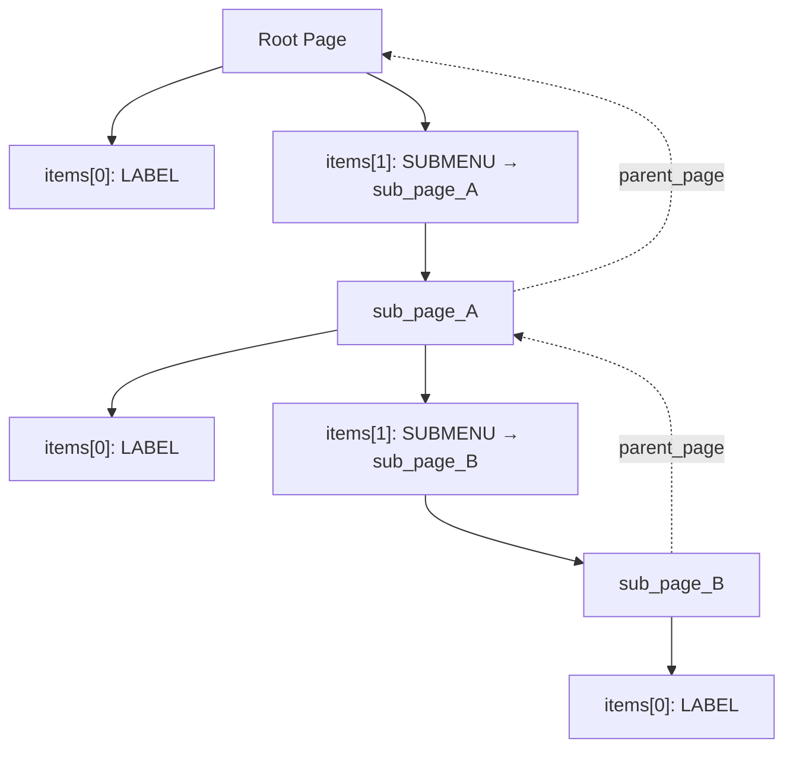
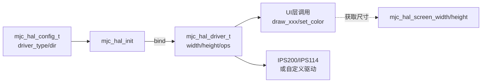

# MujicaUI_Lite 使用说明（数据结构 & 显示 HAL）

## 菜单数据结构（静态页面方式）
- 页面：`mjc_page_t { mjc_item_t* items; uint8_t count; uint8_t selected_index; mjc_page_t* parent_page; }`
- 条目：`mjc_item_t { name, type, union{checkbox/number/submenu}, action, user_data }`
- 关系：子菜单条目通过 `data.submenu -> mjc_page_t` 指向子页面；返回时用 `current_page->parent_page` 找到上级页面。



### 构建示例
```c
// 页面条目
static mjc_item_t root_items[] = {
    { "Title", MJC_ITEM_TYPE_LABEL },
    { "Go Sub", MJC_ITEM_TYPE_SUBMENU },
};
static mjc_page_t root_page = { root_items, 2, 0, NULL };

static mjc_item_t sub_items[] = {
    { "Sub Item", MJC_ITEM_TYPE_LABEL },
};
static mjc_page_t sub_page = { sub_items, 1, 0, NULL };

int main(void) {
    mjc_init(&root_page);                        // 设置根页面 + 初始化显示
    mjc_add_submenu(&root_page, &root_items[1], &sub_page);  // 绑定子页面
}
```

### 导航状态（选中索引）
- 全局仅保存 **`g_current_page`**（当前页指针）。
- **`selected_index` 存在每个 `mjc_page_t` 内**，切换页面时各自保留上次选中位置。
- 进入/返回子菜单不会重置子页选中项（除非 `selected_index >= count`，会钳到 0）。
- 所有页面/条目为静态数组，无动态内存，适合多级嵌套菜单。

### 条目事件语义
| 类型 | 行为 |
|------|------|
| `LABEL` | 可被选中，无默认操作 |
| `SUBMENU` | MAIN → `TRIGGER` → 进入 `data.submenu`（默认 action） |
| `CHECKBOX` | MAIN → 核心翻转 `*checkbox`，再依次投递 `TRIGGER`、`CHANGE`（应用可在 action 里监听 `CHANGE`） |
| `NUMBER` | MAIN → 进入编辑缓冲（`TRIGGER`）；commit 写回 `value_ptr` 并发 `CHANGE`；cancel 发 `EXIT` |
| `ACTION` | MAIN → `TRIGGER`；需自行提供 `action` |

**NUMBER 编辑退出路径（统一）：**
- AUX 单击 / `mjc_page_back` → `mjc_edit_cancel()` → 丢弃缓冲 + `MJC_EVENT_EXIT`
- 任意 `mjc_set_current_page()`（含进子菜单）→ 同样 `mjc_edit_cancel()`（不再静默 clear）
- MAIN 单击 → `mjc_edit_commit()` → 写回 + `MJC_EVENT_CHANGE`

**CHECKBOX 注意：** 翻转由核心完成；自定义 `action` 请只响应事件，**不要再次翻转**，否则会 double-toggle。

---

## 显示 HAL 概览
- `mjc_hal` 为 UI 提供屏幕驱动抽象，可在 IPS200、IPS114 之间切换，并可挂接自定义驱动。
- 自动根据方向配置宽高（`mjc_hal_screen_width/height`），绘制已做越界裁剪。
- `fill_rect` 使用 `ips*_show_rgb565_image` 整区写入，避免逐像素 `draw_line`。

### 默认方向（重要）
| 路径 | 默认 |
|------|------|
| `mjc_hal_get_default_config()` / `MJC_HAL_CONFIG_IPS200_DEFAULT` | **竖屏** `MJC_DIR_PORTRAIT`（IPS200 → 240×320） |
| `mjc_render_init()` | 在默认配置上再次设为 **`MJC_DIR_PORTRAIT`** |
| IPS114 默认宏 | 竖屏 240×135 |

`mjc_init()` → `mjc_render_init()` 会初始化 HAL；若业务只调 `mjc_hal_init` 自行画图，请显式设置 `display_dir`。

### 快速使用（IPS200 或 IPS114）
```c
#include "mjc_hal.h"
#include "mjc_config.h"

int main(void) {
    mjc_hal_config_t cfg = mjc_hal_get_default_config(); // 默认 IPS200 竖屏 240x320, SPI
    // 横屏 320x240:
    // cfg.display_dir = MJC_DIR_LANDSCAPE;
    // 如需 IPS114:
    // cfg = (mjc_hal_config_t)MJC_HAL_CONFIG_IPS114_DEFAULT;

    if (!mjc_hal_init(&cfg)) {
        // init fail
    }

    const mjc_hal_driver_t* drv = mjc_hal_get_driver();
    drv->fill(0x0000);
    drv->draw_string(0, 0, "Hello");
    drv->draw_rect(10, 10, 50, 30, 0xFFFF);
    return 0;
}
```

### HAL API 速览
- 初始化与切换：`mjc_hal_init(cfg)`，`mjc_hal_use_driver(custom)`，`mjc_hal_get_driver()`
- 尺寸：`mjc_hal_screen_width()`，`mjc_hal_screen_height()`
- 绘制接口：`clear` / `fill` / `set_color` / `draw_point` / `draw_line` / `draw_rect` / `fill_rect` / `draw_char` / `draw_string` / `set_font_size`



### 自定义驱动接入
1. 自行实现静态 `mjc_hal_driver_t`，填入 `width/height`、颜色字段和函数指针。
2. `cfg.custom_driver` + `cfg.driver_type = MJC_DRIVER_CUSTOM`，再 `mjc_hal_init(&cfg)`；或直接 `mjc_hal_use_driver(custom_drv)`。

### 方向与分辨率
- IPS200：`MJC_DIR_PORTRAIT` → 240×320，`MJC_DIR_LANDSCAPE` → 320×240。
- IPS114：`MJC_DIR_PORTRAIT` → 240×135，`MJC_DIR_LANDSCAPE` → 135×240。
- 在 `mjc_hal_init` 前设置 `display_dir`；驱动会同步 `width/height`。

---

## 按键输入（multi_button + 事件系统）
- 适配层：`project/code/service/gui/MujicaUI_Lite/mjc_input_button.c`
- multi_button 在 `button_emit` 中 `event_publish_ex(BUTTON_EVENT_BASE + ev, Button*, ASYNC)`
  - **`BUTTON_EVENT_BASE = 0x0200`**（避开 soft_timer 的 `0x0100～0x01FF`）
- mjc 默认订阅：`PRESS_DOWN` / `LONG_PRESS_HOLD` / `SINGLE_CLICK` / `DOUBLE_CLICK`
- **长按 HOLD 节流**：`LONG_HOLD_INTERVAL_TICKS` 默认 = `50 / TICKS_INTERVAL`（约 **50ms** 一次），避免每 5ms 塞满异步队列
- 业务可自行 `event_subscribe` 同一批事件；用 `mjc_input_set_enabled(0)` 关掉菜单消费，不关硬件广播

### 键位与语义（默认）

| 键 | 浏览 | NUMBER 编辑 |
|----|------|-------------|
| UP | 上移（按下/长按连发） | buffer −step；**双击 step÷10** |
| DOWN | 下移 | buffer +step；**双击 step×10** |
| MAIN | **仅单击**：进子菜单 / 切 checkbox / **进 NUMBER 编辑** / ACTION | **仅单击**：commit 缓冲 → `value_ptr`，发 `MJC_EVENT_CHANGE` |
| AUX | **仅单击**：回父页（编辑中则 cancel） | **仅单击**：丢弃缓冲 + `MJC_EVENT_EXIT` |

- 编辑缓冲：过程中不改 `value_ptr`；值前显示 `*`
- 会话 step 可双击改 decade，不永久改 `item->data.number.step`
- 引脚：**A30 / A31 / B0 / B1**（主板板载按键 UP/DOWN/MAIN/AUX，见 `docs/hardware.md` §1 / §4.3）

### 快速接入（与本工程 `main` 风格一致）

当前已通过 `gui_app_init()` 接入 `main.c`（按键 A30/A31/B0/B1 + IPS200）。菜单定义见 `service/gui/gui_app.c`。

### Params 动态设置页（gui_app）

`gui_app_init()` 在全部 `param_add`（及 `param_load`）之后调用，会：

1. 用 `param_get_count()` / `param_get_by_index()` 遍历注册表
2. 按参数名 **首段前缀** 分组（`motor_kp` → 组 `motor`，`chassis_max_v` → 组 `chassis`）
3. 每组生成一页 `NUMBER` 项，`value_ptr` 直接指向业务变量（与串口 `set` 同一份 RAM）
4. 根菜单出现 **Params** 子菜单；组内 MAIN 进入编辑、AUX 返回；Params 内另有 **Save Params**

| 操作 | 效果 |
|------|------|
| 编辑 commit | 写回参数指针；`motor_*` 额外 `motor_apply_param()`；`chassis_*` 由 `chassis_update` 热刷 |
| Save Params | `param_save()` → LFS `/param.txt`（与串口 `save` 相同） |
| 新增 `param_add` | 无需改 GUI 源码；重启后自动出现对应组/项（池上限：分组 12、条目 `PARAM_MAX_COUNT`） |

显示名去掉前缀以省宽度（如 `half_track`）；完整 key 仅用于 apply 判断与日志。

```c
#include "service/gui/MujicaUI_Lite/mjc_core.h"
#include "service/gui/MujicaUI_Lite/mjc_input_button.h"

/* 1) 静态菜单（示例） */
static uint8_t s_demo_flag;
static float   s_demo_kp = 1.0f;

static mjc_item_t root_items[] = {
    { .name = "Demo",  .type = MJC_ITEM_TYPE_LABEL },
    { .name = "Enable",.type = MJC_ITEM_TYPE_CHECKBOX,
      .data.checkbox = &s_demo_flag },
    { .name = "Kp",    .type = MJC_ITEM_TYPE_NUMBER,
      .data.number = { .value_ptr = &s_demo_kp, .num_type = MJC_NUM_FLOAT,
                       .step = 0.1f, .min = 0.0f, .max = 10.0f } },
};
static mjc_page_t root_page = { root_items, 3, 0, NULL };

static void mjc_btn_task(const event_t *e, void *ud)
{
    (void)e; (void)ud;
    mjc_buttons_tick_5ms();
}

static void mjc_ui_task(const event_t *e, void *ud)
{
    (void)e; (void)ud;
    (void)mjc_update();  /* snapshot 无变化则跳过重绘 */
}

/* 2) 在 app_init 中（event_init / soft_timer_init 之后，电机脚占用确认后） */
void gui_app_init(void)
{
    if (!mjc_init(&root_page)) {
        sys_log_text(error, "mjc_init failed");
        return;
    }
    if (!mjc_buttons_init()) {
        sys_log_text(error, "mjc_buttons_init failed");
        return;
    }
    (void)app_start_timer(5,   mjc_btn_task, "mjc_btn");  /* = TICKS_INTERVAL */
    (void)app_start_timer(100, mjc_ui_task,  "mjc_ui");
}

/* 3) 主循环保持不变 */
// while (true) {
//     soft_timer_process();
//     event_process_async();
// }
```

**接入检查清单**
1. `event_init()`、`soft_timer_init()` 已完成
2. 按键已固定主板 **A30/A31/B0/B1**（见 `docs/hardware.md` §1 / §4.3）
3. `mjc_init(&root_page)` → 初始化屏 + 页面树
4. `mjc_buttons_init()` → GPIO + 订阅按键事件
5. **5ms** soft_timer：`mjc_buttons_tick_5ms()`
6. **100ms** soft_timer：`mjc_update()`（库内不绑 timer）
7. 主循环：`soft_timer_process(); event_process_async();`
8. 自定义全屏页抢键：`mjc_input_set_enabled(0);` … 退出后 `mjc_input_set_enabled(1);`
