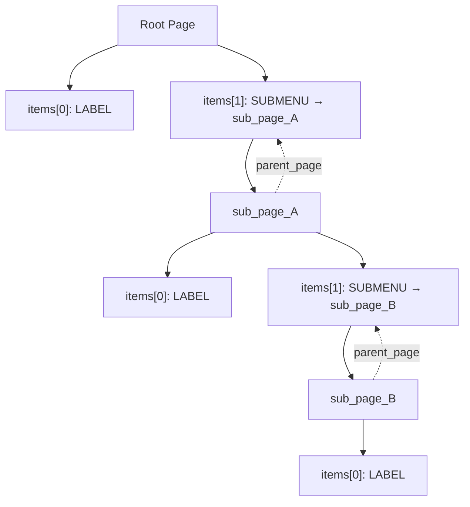
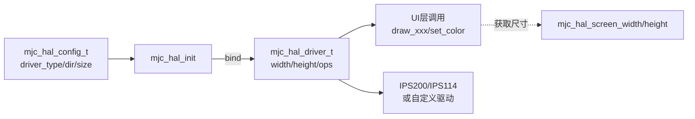

# MujicaUI_Lite 使用说明（数据结构 & 显示 HAL）

## 菜单数据结构（静态页面方式）
- 页面：`mjc_page_t { mjc_item_t* items; uint8_t count; mjc_page_t* parent_page; }`
- 条目：`mjc_item_t { name, type, union{checkbox/number/submenu}, parent(page*), action }`
- 关系：子菜单条目通过 `data.submenu -> mjc_page_t` 指向子页面；返回时可用 `current_page->parent_page` 找到上级。



### 构建示例
```c
// 页面条目
static mjc_item_t root_items[] = {
    { "Title", MJC_ITEM_TYPE_LABEL },
    { "Go Sub", MJC_ITEM_TYPE_SUBMENU },
};
static mjc_page_t root_page = { root_items, 2, 0, NULL };

static mjc_item_t sub_items[] = {
    { "Sub Item", MJC_ITEM_TYPE_LABEL },
};
static mjc_page_t sub_page = { sub_items, 1, 0, NULL };

int main(void) {
    mjc_init(&root_page);                        // 设置根页面
    mjc_add_submenu(&root_page, &root_items[1], &sub_page);  // 绑定子页面
    // 后续在导航逻辑中切换 current_page 指针进入/返回子菜单
}
```

**现状与提醒**
- 现有状态变量：`g_current_page` + `g_selected_index`（全局）。未为每个页面保存独立的选中索引，可按需加“返回栈/每页选中状态”。
- 所有页面/条目为静态数组，无动态内存，适合多级嵌套菜单。

## 显示 HAL 概览
- `mjc_hal` 为 UI 提供屏幕驱动抽象，可在 IPS200、IPS114 之间切换，并可挂接自定义驱动。
- 自动根据方向配置宽高（`mjc_hal_screen_width/height`），内部绘制已做越界裁剪，避免底层断言。

### 快速使用（IPS200 或 IPS114）
```c
#include "mjc_hal.h"
#include "mjc_config.h"

int main(void) {
    mjc_hal_config_t cfg = mjc_hal_get_default_config(); // 默认 IPS200, 横屏 320x240, SPI
    // 如需 IPS114 竖屏 240x135:
    // cfg = MJC_HAL_CONFIG_IPS114_DEFAULT;
    // cfg.display_dir = MJC_DIR_LANDSCAPE; // 改为横屏可选

    if (!mjc_hal_init(&cfg)) {
        // init fail
    }

    const mjc_hal_driver_t* drv = mjc_hal_get_driver();
    drv->fill(0x0000);                     // 清空背景色
    drv->draw_string(0, 0, "Hello");       // 绘制文本
    drv->draw_rect(10, 10, 50, 30, 0xFFFF);
    return 0;
}
```

### HAL API 速览
- 初始化与切换：`mjc_hal_init(cfg)`，`mjc_hal_use_driver(custom)`，`mjc_hal_get_driver()`
- 尺寸：`mjc_hal_screen_width()`，`mjc_hal_screen_height()`
- 绘制接口（在 `mjc_hal_driver_t` 中）：`clear` / `fill` / `set_color` / `draw_point` / `draw_line` / `draw_rect` / `fill_rect` / `draw_char` / `draw_string` / `set_font_size`



### 自定义驱动接入
1. 自行实现一个静态 `mjc_hal_driver_t`，填入 `width/height`、颜色字段和函数指针。
2. 将指针放入 `cfg.custom_driver`，`cfg.driver_type = MJC_DRIVER_CUSTOM`，然后调用 `mjc_hal_init(&cfg)`；或直接 `mjc_hal_use_driver(custom_drv)`。

### 方向与分辨率提示
- IPS200：`MJC_DIR_LANDSCAPE` -> 320x240，`MJC_DIR_PORTRAIT` -> 240x320。
- IPS114：`MJC_DIR_PORTRAIT` -> 240x135（默认），`MJC_DIR_LANDSCAPE` -> 135x240。
- 更改方向请在 `mjc_hal_init` 配置中设置 `display_dir`。驱动内部会同步更新 `width/height`。

## 按键输入（multi_button + 事件系统）
- 适配层：`project/code/service/gui/MujicaUI_Lite/mjc_input_button.c`
- multi_button 在 `button_emit` 中 `event_publish_ex(BUTTON_EVENT_BASE + ev, Button*, ASYNC)`  
  - **`BUTTON_EVENT_BASE = 0x0200`**（避开 soft_timer 的 `0x0100～0x01FF`）
- mjc 默认订阅：`PRESS_DOWN` / `LONG_PRESS_HOLD` / `SINGLE_CLICK` / `DOUBLE_CLICK`
- 业务可自行 `event_subscribe` 同一批事件；用 `mjc_input_set_enabled(0)` 关掉菜单消费，不关硬件广播

### 键位与语义（默认）

| 键 | 浏览 | NUMBER 编辑 |
|----|------|-------------|
| UP | 上移（按下/长按连发） | buffer −step；**双击 step÷10** |
| DOWN | 下移 | buffer +step；**双击 step×10** |
| MAIN | **仅单击**：进子菜单 / 切 checkbox / **进 NUMBER 编辑** / ACTION | **仅单击**：commit 缓冲 → `value_ptr`，发 `MJC_EVENT_CHANGE` |
| AUX | **仅单击**：回父页 | **仅单击**：丢弃缓冲（不写 `value_ptr`） |

- 编辑缓冲：过程中不改 `value_ptr`；值前显示 `*`
- 会话 step 可双击改 decade，不永久改 `item->data.number.step`
- 引脚默认 B13/B12/B14/B15 —— **B12/B13 与右电机冲突**，启用前须改脚（见 `docs/hardware.md`）

### 快速接入
1. `event_init(); mjc_init(&root_page); mjc_buttons_init();`
2. **5ms** soft_timer：`mjc_buttons_tick_5ms()`
3. **100ms** soft_timer：`mjc_update()`（库内不绑 timer；snapshot 无变化则跳过重绘）
4. 主循环：`soft_timer_process(); event_process_async();`
5. 自定义全屏页抢键：`mjc_input_set_enabled(0);`，自行 subscribe；退出后 `mjc_input_set_enabled(1);`
